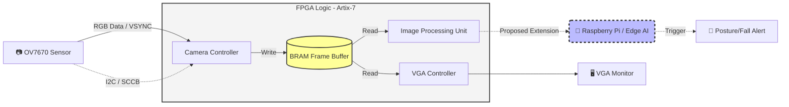

# 🏃‍♂️ Real-Time Fall Detection System (FPGA & Edge AI)

**Final Engineering Project | JCT (Jerusalem College of Technology)** **Team:** Yossi Brim & Elad Asbag  
**Target Board:** Nexys A7 (Artix-7 xc7a100tcsg324-1)

---

## 📌 Project Overview
This project implements a real-time video processing pipeline designed to detect posture changes and falls. The system leverages the parallel processing capabilities of an FPGA for image acquisition and hardware-level buffering, coupled with an architectural design for Edge AI integration.

> ⚠️ **Project Scope & AI Disclaimer**
> The primary, guaranteed deliverable of this engineering project is the robust FPGA hardware pipeline (OV7670 Camera ➔ BRAM Buffering ➔ VGA Display). 
> The Edge AI software layer (MobileNet-SSD) has been successfully proven as a **Proof of Concept (PoC) on a Raspberry Pi**. However, within the scope of this specific repository, its full integration with the FPGA hardware remains a proposed extension for future development.

**Key Features:**
* **Image Acquisition:** Live video capture from an OV7670 camera via SCCB/I2C configuration.
* **Hardware Buffering:** Fast frame buffering utilizing on-chip Block RAM (BRAM).
* **Video Output:** Real-time VGA controller output.
* **Architecture:** Hardware design ready for posture change / fall detection data handoff.

## 🏗️ System Architecture



## 📂 Repository Structure

The repository is organized according to industry-standard RTL project hierarchies:

* **`/rtl`** - Core VHDL source files (Camera, Display, Image Processing, Top-level).
* **`/constraints`** - Physical hardware constraints (`.xdc` for Nexys A7).
* **`/ip`** - Pre-configured Vivado IP blocks (e.g., `clk_wiz`, `blk_mem_gen`).
* **`/tb`** - Testbenches and simulation scripts for module verification.
* **`/software`** - Edge AI scripts and software-level controllers.
* **`/docs`** - Technical documentation and internal setup guides.
* **`/report`** - Academic documents, project book, and presentations.

## 🚀 Quick Start & Daily Workflow

**🛑 IMPORTANT:** Do NOT track, commit, or transfer Vivado `.xpr` files. 

This project uses a Tcl-based generation system to prevent merge conflicts and broken absolute paths.

1. Clone this repository to your local machine.
2. Open Vivado (do not create or open a project).
3. Open the **Tcl Console** and navigate to the repository's root directory.
4. Run the build script to automatically generate the complete project environment:
   ```tcl
   source build_project.tcl
   ```
5. Run the standard flow: `Synthesis` → `Implementation` → `Generate Bitstream`.

*For complete workflow instructions, team synchronization rules, and Tcl script updates, please read [docs/SETUP.md](./docs/SETUP.md).*

## 🔌 Hardware Outputs & Interfaces

* **VGA Out:** `VGA_R[3:0]`, `VGA_G[3:0]`, `VGA_B[3:0]`, `VGA_HS`, `VGA_VS`
* **Camera Control:** `ov7670_xclk`, `ov7670_pwdn`, `ov7670_reset`
* **Status & Detection:** `posture_change_detected`, `current_posture`, System LEDs
