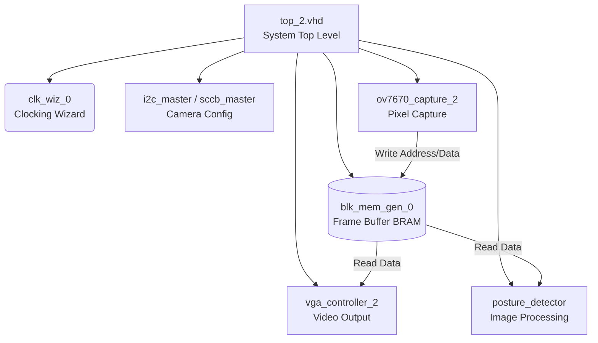

# 🏗️ Hardware Architecture & RTL Design

This document outlines the internal hardware design implemented on the Artix-7 FPGA for the Fall Detection pipeline.

## 🧩 Module Hierarchy

## 📜 Core Components Description

* **`top_2.vhd`:** The main wrapper that instantiates all sub-modules, routes internal signals (like pixel buses and synchronization flags), and connects them to the physical I/O pins.
* **Camera Capture (`ov7670_capture_2.vhd`):** Samples the `PCLK` from the sensor, reconstructs RGB565 pixels from byte-sized chunks, and generates write addresses for the memory block based on `VSYNC` and `HREF`.
* **Frame Buffer (`blk_mem_gen_0`):** Dual-port Block RAM configured to store the active video frame. Port A is driven by the camera capture module (write-only), and Port B is accessed by the VGA and processing modules (read-only).
* **VGA Controller (`vga_controller_2.vhd`):** Generates standard VGA timing signals (`Hsync`, `Vsync`) and pulls pixel data from the BRAM to display the live feed.
* **Debounce & Utilities:** Handles clean transitions for physical push-buttons used for system resets and mode switching.
