<!-- ========================================== -->
<!-- שקף 1: שער ומטרת הפרויקט                   -->
<!-- ========================================== -->

# פיתוח מערכת מבוססת FPGA להתראת נפילה לחולי דמנציה

קליטת תמונה בזמן אמת ממצלמת OV7670 והצגתה דרך כרטיס Artix-7. 
על מנת לאפשר עיבוד תמונה לזיהויי עמידה ממושכת לחולי דמנציה.

  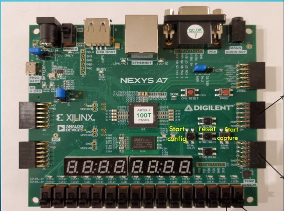

מגיש: יוסי ברים | הנדסת חשמל שנה ד' | המרכז האקדמי לב

---
<!-- ========================================== -->
<!-- שקף 2: ארכיטקטורת המערכת                   -->
<!-- ========================================== -->

# ארכיטקטורת המערכת

* נתוני התמונה הגולמיים נקלטים מהמצלמה ונאגרים בזיכרון ה-`BRAM`.
* בקר ה-`VGA` שולף את הנתונים ומעביר לממיר `D to A` לקבלת אות אנלוגי פיזי למסך.

<!-- מודל הקופסה השחורה - כניסות ויציאות -->

  

    <strong>Inputs:</strong> clk, reset ov7670_vsync, href, pclk ov7670_data[7:0] btn[1:0], sw[1:0] scl, sda
  

  
➡️

  

    מערכת התראת נפילה מבוססת FPGA
  

  
➡️

  

    <strong>Outputs:</strong> VGA_HS_O, VGA_VS_O VGA_R[3:0], G[3:0], B[3:0] ov7670_xclk, pwdn, reset led[3:0]
  

<!-- מודל הצנרת הפנימית -->

  
ov7670_capture

  
➡️

  
frame_buffer

  
➡️

  
vga_controller

  
➡️

  
D to A Converter

---

<!-- ========================================== -->
<!-- שקף 3: מבוא ל-VGA - קונספט תותח האלקטרונים -->
<!-- ========================================== -->

# מבוא ל-VGA: קונספט תותח האלקטרונים (CRT)

  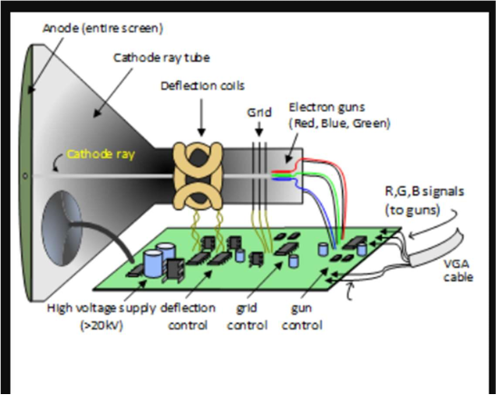

* **מקור הפרוטוקול:** טכנולוגיית ה-VGA פותחה במקור עבור מסכי שפופרת קרן קתודית (CRT) המבוססים על פיזיקה אנלוגית.
* **תותח אלקטרונים:** המסך פועל באמצעות קרן פיזית הנורית על גבי מסך מצופה זרחן. עוצמת הזרם קובעת את עוצמת ההארה של כל פיקסל.
* **המורשת האנלוגית:** למרות שכיום המסכים מודרניים, הפרוטוקול מחייב שידור אותות השהייה שיאפשרו לקרן הפיזית זמן תנועה וחזרה.

---

<!-- ========================================== -->
<!-- שקף 4: מבוא ל-VGA - סריקה קווית            -->
<!-- ========================================== -->

# מבוא ל-VGA: סריקה קווית (Raster Scan)

  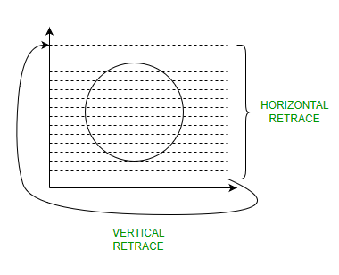

* הציור על המסך מבוסס על קרן שסורקת את הפיקסלים משמאל לימין (שורה) ומלמעלה למטה (פריים).
* תנועת הקרן חייבת להיות רציפה, מה שיוצר מסלול בצורת 'זיגזג'.
* בכל פעם שהקרן מגיעה לקצה (אופקי או אנכי), נדרש זמן כדי להחזיר אותה לנקודת ההתחלה (`Retrace`).

---

<!-- ========================================== -->
<!-- שקף 5: תזמוני VGA - הפיזיקה מאחורי המספרים -->
<!-- ========================================== -->

# תזמוני VGA: הפיזיקה מאחורי המספרים

| פרמטר | מחזורי שעון | הצורך הפיזיקלי המקורי (CRT) | המימוש שלנו (RTL) |
| :---: | :---: | :--- | :--- |
| **Active Display** | 640 | הקרן מציירת את הפיקסלים הפיזיים על המסך משמאל לימין. | שליפת נתונים מה-`BRAM` ושידור צבע (`RGB`) פעיל. |
| **Front Porch** | 16 | מרווח זמן לקרן 'להירגע' בסוף השורה לפני שחוזרת אחורה. | כיבוי מיידי של ה-`RGB` ל-'0000' למניעת מריחות. |
| **Sync Pulse** | 96 | מכת מתח (טריגר) שמאלצת את הקרן לקפוץ חזרה שמאלה. | הורדת האות הפיזי `HSYNC` ל-'0' למשך 96 שעונים. |
| **Back Porch** | 48 | המתנה לייצוב הקרן בתחילת השורה החדשה בצד שמאל. | המשך השהיית ה-`RGB` על '0000' עד הגעה לפיקסל הראשון. |

---

<!-- ========================================== -->
<!-- שקף 6: תזמונים והחשכה בחומרה (VGA Controller) -->
<!-- ========================================== -->

# תזמונים והחשכה בחומרה (VGA Controller)

* **מחזור שלם (800 פיקסלים):** חיבור הערכים (640+16+96+48) דורש מהמונה האופקי (`h_count`) לספור מ-0 ועד 799.
* **שעון פיקסל 25MHz:** כל פיקסל שקול למחזור שעון אחד של `40ns`. סנכרון זה מבטיח קצב ריענון תקני של `60Hz`.
* **אכיפת שחור (Blanking):** מחוץ לתחום ה-640, הלוגיקה שלנו מאלצת `0000` ב-`RGB` כדי למנוע 'מריחות' צבע בעת תנועת הקרן.

  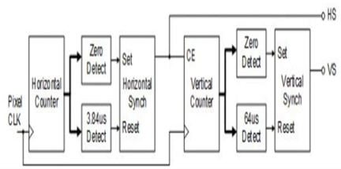
  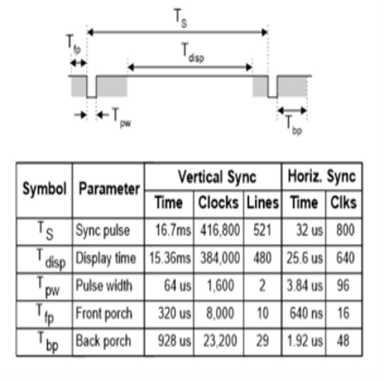

---
<!-- ========================================== -->
<!-- שקף 7: מסלול הנתונים - חישוב כתובת ושליפה מה-BRAM -->
<!-- ========================================== -->

# מסלול הנתונים מהBRAM : חישוב כתובת הפיקסל ושליפה

* **מיקום הקרן (X,Y):** המונים `hsync_reg` ו-`vsync_reg` מפיקים את הקואורדינטות הדינמיות `display_x` ו-`display_y` בתוך האזור הפעיל.
* **תרגום לכתובת ליניארית:** הקואורדינטה מתורגמת מתמטית לכתובת הזיכרון `bram_address_next` ונשלחת החוצה דרך האות `addrb`.
* **שליפה מה-BRAM:** רכיב ה-`frame_buffer` מקבל את הכתובת ומשחרר את 12 הביטים של הפיקסל היישר אל האות `doutb` של בקר ה-`VGA`.

  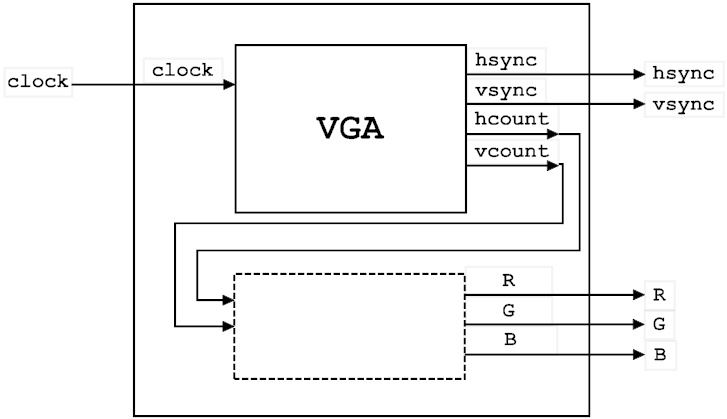

---
<!-- ========================================== -->
<!-- שקף 8: עיבוד הפיקסל: ניתוב ל-RGB ומנגנון ה-Blanking -->
<!-- ========================================== -->

# עיבוד הפיקסל: ניתוב ל-RGB ומנגנון ה-Blanking

* **רישום ופיצול:** הנתונים מ-`doutb` ננעלים באוגר `pxl_data_reg` ומפוצלים לשגרירים: `vga_r_int` (ביטים 11:8), `vga_g_int` (7:4) ו-`vga_b_int` (3:0).
* **שומר הסף:** האות `in_display_area_delayed` משמש כדגל המזהה האם הקרן מצירת כעת על המסך או נמצאת מחוץ לתצוגה.
* **סינון דיגיטלי (Mux):** כאשר הדגל ב-'1', ערכי ה-`RGB` מועברים ליציאות `VGA_R/G/B`. בזמני ה-`Porch` וה-`Sync`, היציאות נאלצות ל-"0000" (שחור מוחלט).

  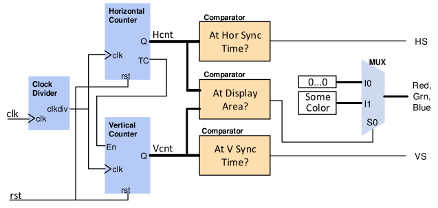

---

<!-- ========================================== -->
<!-- שקף 9: המרת DAC אנלוגית ומחבר ה-VGA         -->
<!-- ========================================== -->

# המרת DAC אנלוגית ומחבר ה-VGA

* **סולם נגדים (Resistor Network):** המרת 12 ביטי ה-`RGB` למתח אנלוגי רציף באמצעות סולם נגדים (`510Ω` עד `4KΩ`).
* **אותות סנכרון (B11 / B12):** פיני היציאה מוגנים באמצעות נגדי `100Ω` ומזינים ישירות את מחבר ה-`DB15` של המסך.

  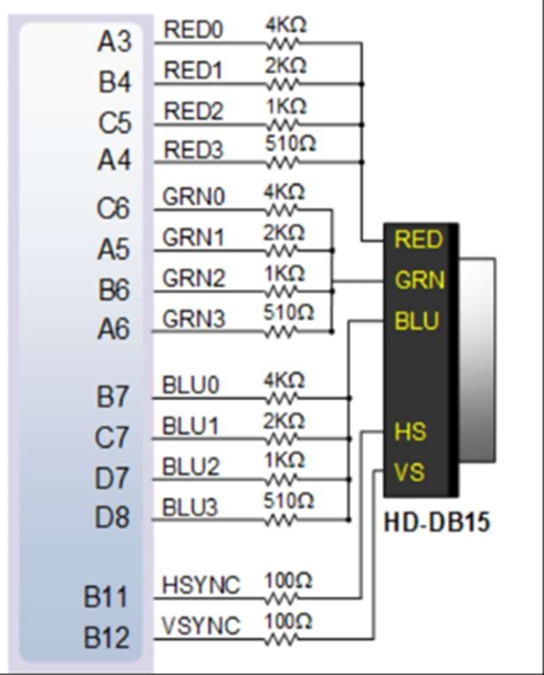
  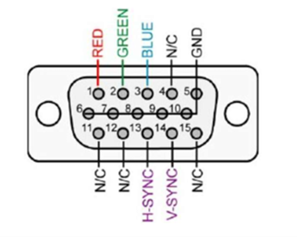

---

<!-- ========================================== -->
<!-- שקף 10: מחלק המתח ומשקלי הביטים             -->
<!-- ========================================== -->

# מחלק המתח ומשקלי הביטים

* **משקל פיזי לכל ביט (MSB לעומת LSB):** הביט המשמעותי ביותר (`MSB`) מחובר לנגד הקטן ביותר, ולכן מזריק את הזרם הגדול ביותר למעגל ומשפיע משמעותית על עוצמת הצבע.
* **כוונון עדין:** לעומתו, הביט הפחות משמעותי (`LSB`) מחובר לנגד הגדול ביותר בסולם. תרומתו לזרם הכולל היא מזערית ונועדה לכוונון עדין של הגוון.
* **סכימה אנלוגית על המסך:** כל הזרמים מהביטים הפעילים ('1') מתחברים וזורמים יחד דרך נגד הסיומת של המסך (`75Ω`) אל האדמה. כך נוצר מחלק מתח דינמי המפיק 0V עד 0.7V.

  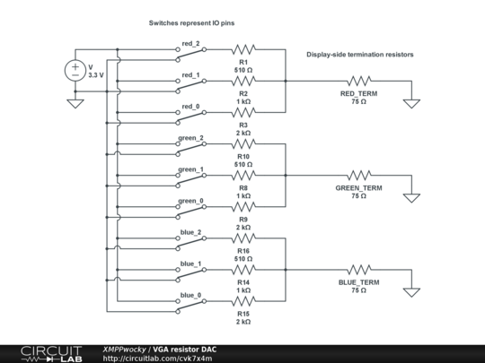

---

<!-- ========================================== -->
<!-- שקף 11: סיכום תיאורטי: לקראת ארכיטקטורת החומרה -->
<!-- ========================================== -->

# סיכום תיאורטי: לקראת ארכיטקטורת החומרה

* **האתגר הפיזיקלי:** ראינו שהמסך החיצוני דורש תזמונים מדויקים ונוקשים (Sync, Blanking) והמרת צבע רציפה (DAC) כדי לפעול כראוי.
* **המעבר פנימה (FPGA):** כדי לייצר את האותות הללו בזמן אמת ובאמינות מוחלטת, אנו נכנסים אל תוך הלוגיקה הדיגיטלית (RTL) על הכרטיס.
* **תפקיד ה-VGA Controller:** זהו רכיב הגישור הסופי במערכת. הוא שואב נתונים מהזיכרון הפנימי ומתרגם אותם לאותות הפיזיים שהמסך דורש.
* **התחנה הבאה:** נמפה את האקו-סיסטם על הכרטיס (שעונים, מצלמה, חוצץ זיכרון) ולאחר מכן נצלול פנימה אל הלוגיקה של בקר ה-VGA עצמו.

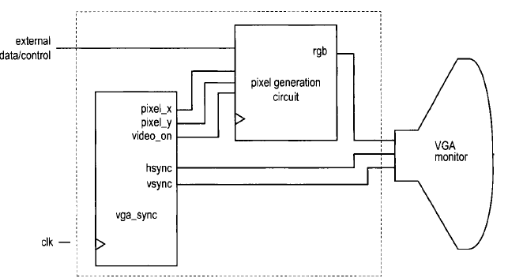

---

<!-- ========================================== -->
<!-- שקף 10: מבט-על - זרימת נתונים ותחומי שעון (RTL) -->
<!-- ========================================== -->

# מבט-על: זרימת נתונים ותחומי שעון (RTL)

* **מחולל שעונים (clk_generator):** PLL המפיק שעון 25MHz ל-VGA ושעון למצלמה.
* **גישור חציית שעונים (CDC):** BRAM (Dual-Port) כחוצץ בטוח בין כתיבה לקריאה.
* **תחום אדום (Camera Domain):** קליטת פיקסלים (ov7670_capture) ודחיפה לפורט A (`clka`).
* **תחום כחול (VGA Domain):** שליפה מפורט B (`clkb`) על ידי בקר ה-VGA.

  
  <!-- התמונה החדשה עם המסגרות, בגודל ענק ובולט -->
  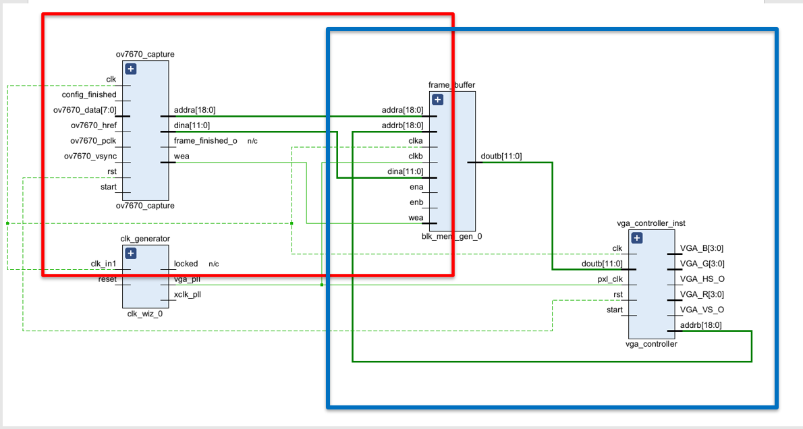

---
<!-- ========================================== -->
<!-- שקף 11: צלילה לתכן - ניהול שעונים (Clock Generator) -->
<!-- ========================================== -->

# ניהול שעונים במערכת (Clock Generator)

* **מקור שעון (System Clock):** כניסת `clk` מקבלת את שעון הלוח המקורי (100MHz) ומזינה את ה-PLL (`clk_wiz_0`).
* **שעון תצוגה (vga_pll):** הפקת 25MHz המזין את בקר ה-VGA (`pxl_clk`) ואת פורט הקריאה (`clkb`) ב-BRAM.
* **שעון מצלמה (xclk_pll):** הפקת שעון ייעודי של 24MHz (`xclk_ov7670`) המנותב החוצה לסנכרון המצלמה.

  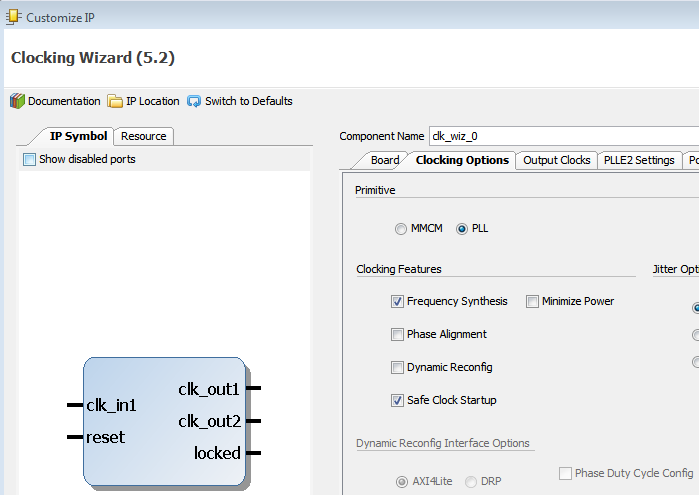

---