<!-- ========================================== -->
<!-- שקף 1: שער ומטרת הפרויקט -->
<!-- ========================================== -->

# פיתוח מערכת מבוססת FPGA להתראת נפילה לחולי דמנציה

קליטת תמונה בזמן אמת ממצלמת OV7670 והצגתה דרך כרטיס Artix-7. 
על מנת לאפשר עיבוד תמונה לזיהויי עמידה ממושכת לחולי דמנציה.

מגיש: יוסי ברים | הנדסת חשמל שנה ד | המרכז האקדמי לב

---

<!-- ========================================== -->
<!-- שקף 2: ארכיטקטורת המערכת -->
<!-- ========================================== -->

# ארכיטקטורת המערכת

נתוני התמונה הגולמיים נקלטים מהמצלמה ונאגרים בזיכרון ה-BRAM. 
בקר ה-VGA שולף את הנתונים ומעביר לממיר D to A לקבלת אות אנלוגי פיזי למסך.

<!-- ייצוג ויזואלי לבלוקים שיצרת בפייתון -->

  
  

    <b>Inputs:</b> clk, reset ov7670_vsync, href, pclk ov7670_data[7:0]
  

  
  
&#8594;

  
  

    מערכת התראת נפילה מבוססת FPGA
  

  
&#8594;

  

    <b>Outputs:</b> VGA_HS_O, VGA_VS_O VGA_R[3:0], G, B ov7670_xclk, pwdn
  

  
ov7670_capture
 &#8594;
  
frame_buffer
 &#8594;
  
vga_controller
 &#8594;
  
D to A Converter

---

<!-- ========================================== -->
<!-- שקף היסטוריה: קונספט תותח האלקטרונים -->
<!-- ========================================== -->

# מבוא ל-VGA: קונספט תותח האלקטרונים (CRT)

* **מקור הפרוטוקול:** טכנולוגיית ה-VGA פותחה במקור עבור מסכי שפופרת קרן קתודית (CRT) המבוססים על פיזיקה אנלוגית.
* **תותח אלקטרונים:** המסך פועל באמצעות קרן פיזית הנורית על גבי מסך מצופה זרחן. עוצמת הזרם קובעת את עוצמת ההארה של כל פיקסל.
* **המורשת האנלוגית:** למרות שכיום המסכים מודרניים, הפרוטוקול מחייב שידור אותות השהייה שיאפשרו לקרן הפיזית זמן תנועה וחזרה.

---

<!-- ========================================== -->
<!-- שקף 3: סריקה קווית -->
<!-- ========================================== -->

# מבוא ל-VGA: סריקה קווית (Raster Scan)

* הציור על המסך מבוסס על קרן שסורקת את הפיקסלים משמאל לימין (שורה) ומלמעלה למטה (פריים).
* תנועת הקרן חייבת להיות רציפה, מה שיוצר מסלול בצורת 'זיגזג'.
* בכל פעם שהקרן מגיעה לקצה (אופקי או אנכי), נדרש זמן כדי להחזיר אותה לנקודת ההתחלה (Retrace).

---

<!-- ========================================== -->
<!-- שקף תוספת: טבלת תזמונים פיזיקלית -->
<!-- ========================================== -->

# תזמוני VGA: הפיזיקה מאחורי המספרים

<table style="width: 95%; text-align: center; font-size: 14px; border-collapse: collapse; direction: rtl;">
  <tr style="background-color: #4F81BD; color: white;">
    <th style="padding: 8px; border: 1px solid #ccc;">פרמטר</th>
    <th style="padding: 8px; border: 1px solid #ccc;">מחזורי שעון</th>
    <th style="padding: 8px; border: 1px solid #ccc;">הצורך הפיזיקלי המקורי (CRT)</th>
    <th style="padding: 8px; border: 1px solid #ccc;">המימוש שלנו (RTL)</th>
  </tr>
  <tr>
    <td style="padding: 8px; border: 1px solid #ccc; font-weight: bold;">Active Display</td>
    <td style="padding: 8px; border: 1px solid #ccc; font-weight: bold; direction: ltr;">640</td>
    <td style="padding: 8px; border: 1px solid #ccc; text-align: right;">הקרן מציירת את הפיקסלים הפיזיים על המסך משמאל לימין.</td>
    <td style="padding: 8px; border: 1px solid #ccc; text-align: right;">שליפת נתונים מה-BRAM ושידור צבע (RGB) פעיל.</td>
  </tr>
  <tr>
    <td style="padding: 8px; border: 1px solid #ccc; font-weight: bold;">Front Porch</td>
    <td style="padding: 8px; border: 1px solid #ccc; font-weight: bold; direction: ltr;">16</td>
    <td style="padding: 8px; border: 1px solid #ccc; text-align: right;">מרווח זמן לקרן 'להירגע' בסוף השורה לפני שחוזרת אחורה.</td>
    <td style="padding: 8px; border: 1px solid #ccc; text-align: right;">כיבוי מיידי של ה-RGB ל-'0000' למניעת מריחות.</td>
  </tr>
  <tr>
    <td style="padding: 8px; border: 1px solid #ccc; font-weight: bold;">Sync Pulse</td>
    <td style="padding: 8px; border: 1px solid #ccc; font-weight: bold; direction: ltr;">96</td>
    <td style="padding: 8px; border: 1px solid #ccc; text-align: right;">מכת מתח (טריגר) שמאלצת את הקרן לקפוץ חזרה שמאלה.</td>
    <td style="padding: 8px; border: 1px solid #ccc; text-align: right;">הורדת האות הפיזי HSYNC ל-'0' למשך 96 שעונים.</td>
  </tr>
  <tr>
    <td style="padding: 8px; border: 1px solid #ccc; font-weight: bold;">Back Porch</td>
    <td style="padding: 8px; border: 1px solid #ccc; font-weight: bold; direction: ltr;">48</td>
    <td style="padding: 8px; border: 1px solid #ccc; text-align: right;">המתנה לייצוב הקרן בתחילת השורה החדשה בצד שמאל.</td>
    <td style="padding: 8px; border: 1px solid #ccc; text-align: right;">המשך השהיית ה-RGB על '0000' עד הגעה לפיקסל הראשון.</td>
  </tr>
</table>

---

<!-- ========================================== -->
<!-- שקף 5: תזמונים והחשכה בחומרה -->
<!-- ========================================== -->

# תזמונים והחשכה בחומרה (VGA Controller)

* **מחזור שלם (800 פיקסלים):** חיבור הערכים (640+16+96+48) דורש מהמונה האופקי ספירה מ-0 ועד 799.
* **שעון פיקסל 25MHz:** כל 'פיקסל' שקול למחזור שעון אחד של 40ns. סנכרון זה מבטיח קצב ריענון תקני של 60Hz.
* **אכיפת שחור (Blanking):** מחוץ לתחום ה-640, הלוגיקה שלנו מאלצת "0000" ב-RGB כדי למנוע 'מריחות' צבע בעת תנועת הקרן.

  
  

---

<!-- ========================================== -->
<!-- שקף 6: מסלול הנתונים -->
<!-- ========================================== -->

# מסלול הנתונים: חישוב כתובת הפיקסל ושליפה

* **מיקום הקרן (X,Y):** המונים מפיקים את הקואורדינטות הדינמיות `display_x` ו-`display_y` בתוך האזור הפעיל.
* **תרגום לכתובת ליניארית:** הקואורדינטה מתורגמת מתמטית לכתובת הזיכרון `bram_address_next` ונשלחת החוצה דרך האות `addrb`.
* **שליפה מה-BRAM:** רכיב ה-frame_buffer מקבל את הכתובת ומשחרר 12 ביטים של צבע היישר אל בקר ה-VGA.

---

<!-- ========================================== -->
<!-- שקף 7: פענוח הצבע ובקרת וידאו -->
<!-- ========================================== -->

# עיבוד הפיקסל: ניתוב ל-RGB ומנגנון ה-Blanking

* **רישום ופיצול:** הנתונים מ-`doutb` ננעלים באוגר ומפוצלים ל-`vga_r_int` (ביטים 11:8), `vga_g_int` (7:4) ו-`vga_b_int` (3:0).
* **שומר הסף:** האות `in_display_area_delayed` משמש כדגל המזהה האם הקרן מצוירת כעת על המסך או נמצאת מחוץ לתצוגה.
* **סינון דיגיטלי (Mux):** כאשר הדגל ב-'1', ה-RGB מועברים החוצה. בזמני ה-Porch וה-Sync, היציאות נאלצות ל-"0000".

---

<!-- ========================================== -->
<!-- שקף 8: המעבר לעולם האנלוגי -->
<!-- ========================================== -->

# המרת DAC אנלוגית ומחבר ה-VGA

* **סולם נגדים (Resistor Network):** המרת 12 ביטי ה-RGB למתח אנלוגי רציף באמצעות משקולות נגדים (510Ω עד 4KΩ).
* **אותות סנכרון:** פיני היציאה מוגנים באמצעות נגדי 100Ω ומזינים ישירות את מחבר ה-DB15 של המסך.

  
  

---

<!-- ========================================== -->
<!-- שקף 9: מחלק המתח -->
<!-- ========================================== -->

# מחלק המתח ומשקלי הביטים

* **משקל פיזי לכל ביט:** ה-MSB מחובר לנגד הקטן ביותר, מזרים את הזרם הגדול ביותר, ומשפיע משמעותית על עוצמת הצבע.
* **כוונון עדין:** לעומתו, ה-LSB מחובר לנגד הגדול ביותר. תרומתו לזרם מזערית ונועדה לכוונון עדין של הגוון.
* **סכימה אנלוגית:** הזרמים מתחברים וזורמים יחד דרך נגד הסיומת של המסך (75Ω) לאדמה ליצירת מתח דינמי בין 0V ל-0.7V.

---

<!-- ========================================== -->
<!-- שקף 10: סיכום תיאורטי לקראת ארכיטקטורה -->
<!-- ========================================== -->

# סיכום תיאורטי: לקראת ארכיטקטורת החומרה

* **האתגר הפיזיקלי:** המסך החיצוני דורש תזמונים מדויקים ונוקשים והמרת צבע רציפה כדי לפעול כראוי.
* **המעבר פנימה (FPGA):** כדי לייצר את האותות בזמן אמת, אנו נכנסים אל תוך הלוגיקה הדיגיטלית (RTL).
* **תפקיד בקר ה-VGA:** רכיב הגישור הסופי השואב נתונים מהזיכרון ומתרגם אותם לאותות פיזיים למסך.
* **התחנה הבאה:** מיפוי האקו-סיסטם על הכרטיס, ולאחר מכן צלילה פנימה אל הלוגיקה.

---

<!-- ========================================== -->
<!-- שקף 10 (המשך): מבט-על RTL -->
<!-- ========================================== -->

# מבט-על: זרימת נתונים ותחומי שעון (RTL)

* **מחולל שעונים:** רכיב PLL המקבל שעון מערכת ומפיק שעון 25MHz ל-VGA ושעון ייעודי למצלמה.
* **חציית שעונים (CDC):** ה-BRAM (Dual-Port) פועל כחוצץ בטוח בין קצב הכתיבה לקצב הקריאה.
* **תחום אדום (Camera Domain):** קליטת פיקסלים מהמצלמה ודחיפתם לפורט A.
* **תחום כחול (VGA Domain):** המיקוד שלנו – שליפת הפיקסלים מפורט B על ידי בקר ה-VGA וייצור אותות תצוגה.

---

<!-- ========================================== -->
<!-- שקף 11: ניהול שעונים -->
<!-- ========================================== -->

# ניהול שעונים במערכת (Clock Generator)

* **מקור שעון:** כניסת `clk` מקבלת את שעון הלוח (100MHz) ומזינה את ה-PLL.
* **שעון תצוגה (vga_pll):** ה-PLL מפיק 25MHz המזין את בקר ה-VGA ואת פורט הקריאה ב-BRAM.
* **שעון מצלמה (xclk_pll):** הפקת שעון ייעודי של 24MHz המנותב החוצה לסנכרון המצלמה.

---

<!-- ========================================== -->
<!-- שקף 12: חוצץ התמונה -->
<!-- ========================================== -->

# זיכרון ה-BRAM: חוצץ התמונה (Frame Buffer)

* **תצורת Dual-Port:** הפרדה לפורט כתיבה (A) וקריאה (B). הפתרון שלנו ל-CDC המונע התנגשויות.
* **שעונים א-סינכרוניים:** הכתיבה מתבצעת ב-100MHz, הקריאה מונעת על ידי שעון ה-VGA ב-25MHz.
* **ממדי הזיכרון:** מוקצה במדויק ל-307,200 פיקסלים ברוחב 12 ביט.
* **תפוקת הנתונים:** האות `doutb` משחרר צבע (RGB) בכל מחזור שעון ישירות לבקר.

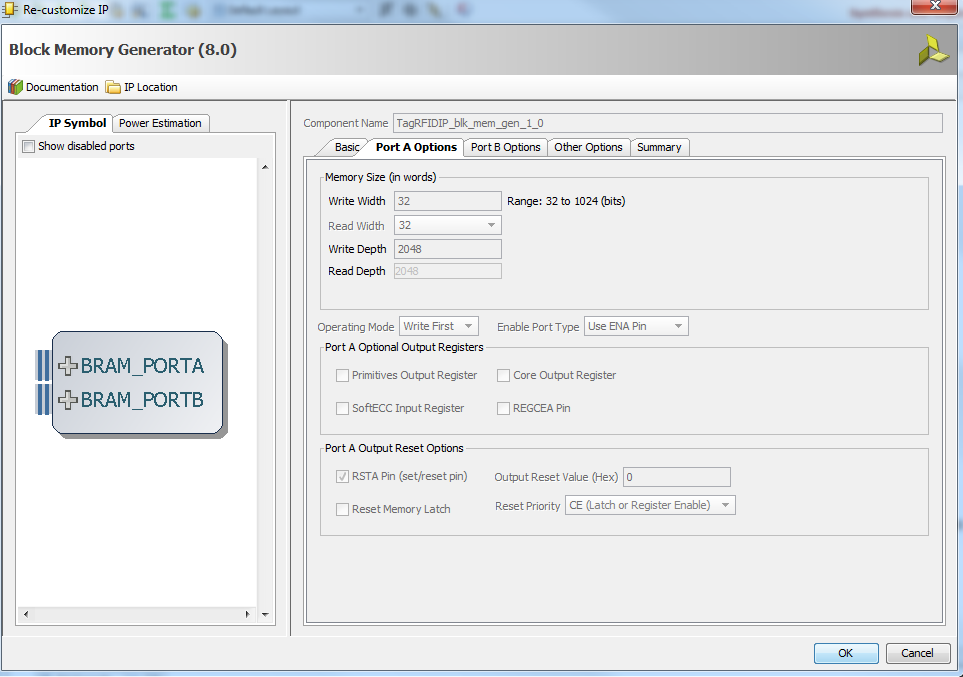

---

<!-- ========================================== -->
<!-- שקף 13: הצד האדום -->
<!-- ========================================== -->

# ממשק המצלמה: מהעולם הפיזי אל הזיכרון

* **הגשר הפיזי:** ה-FPGA מפיק 24MHz למצלמה. המצלמה משדרת חזרה פיקסלים יחד עם שעון סנכרון משלה (PCLK).
* **לכידת הנתונים:** רכיב הלכידה רץ ב-100MHz המאפשר דגימה מהירה ובטוחה של ה-PCLK.
* **כתיבה לזיכרון:** הבלוק מייצר את הכתובת (`addra`), המידע (`dina`), ודגל הכתיבה (`wea`) ודוחף לפורט A ב-BRAM.

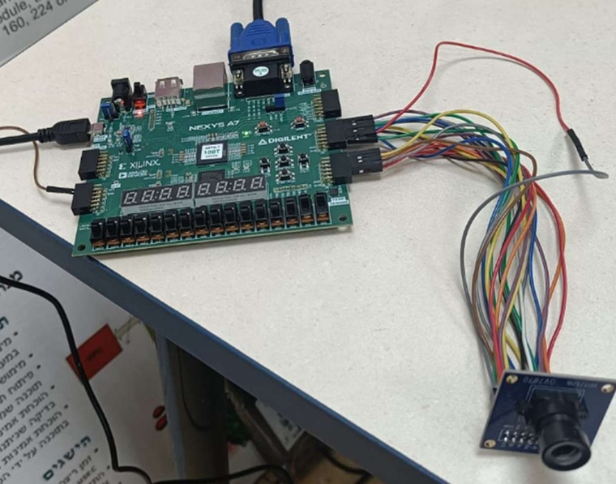

---

<!-- ========================================== -->
<!-- שקף 15: ממשק הזיכרון -->
<!-- ========================================== -->

# ממשק הזיכרון (BRAM): ממדים וסנכרון נתונים

* **תרגום קואורדינטות:** הכתובת `addrb` מחושבת מתמטית לפי המיקום: `Y * 640 + X`.
* **מנגנון ה-Pipeline:** הקריאה א-סינכרונית. הקוד נועל את הנתון הנכנס לאוגר פנימי בעליית השעון הבאה.
* **סנכרון שומר הסף:** הדגל `in_display_area` מושהה גם הוא במחזור שעון אחד לפצות על השהיית הזיכרון.
* **ניתוב דיגיטלי:** רק כאשר הדגל המושהה דולק, 12 הביטים מנותבים ליציאות הצבע.

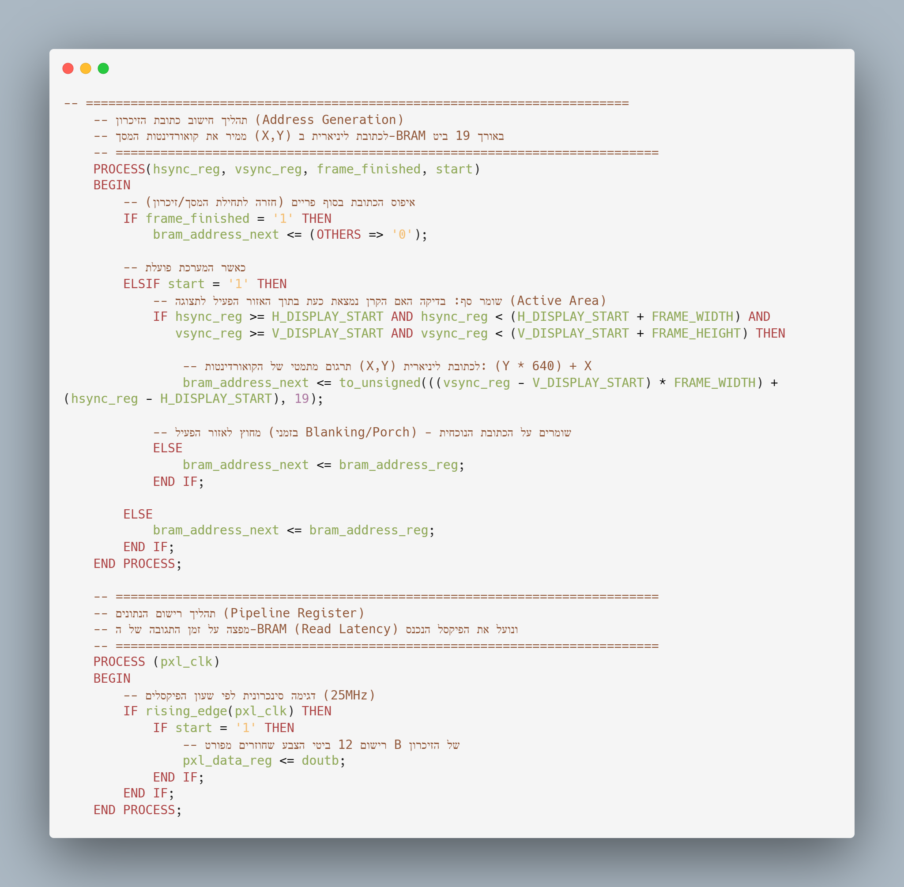

---

<!-- ========================================== -->
<!-- שקף 16: סימולציית מסלול הנתונים -->
<!-- ========================================== -->

# אימות מסלול הנתונים: VGA Controller ↔ BRAM

* **מטרת הסימולציה:** הוכחת לחיצת היד (Handshake) שבין בקשת הכתובת לקבלת הנתון.
* **דגימה בזמן אמת:** הכתובת עולה, המידע מופיע מיידית ב-`doutb` וננעל באוגר בעליית השעון.
* **מניעת זבל ויזואלי:** במעבר ל-Blanking, יציאות ה-RGB נחתכות ל-0 מיידית, למרות שהזיכרון פולט מידע.

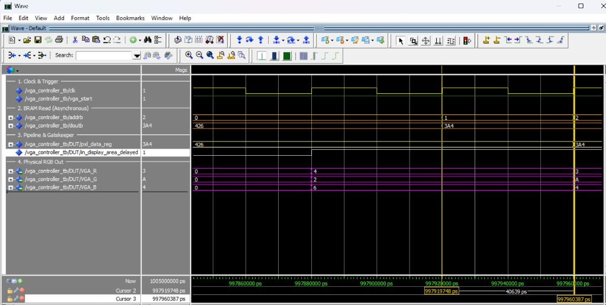

---

<!-- ========================================== -->
<!-- שקף 17: מחזור שורה שלם -->
<!-- ========================================== -->

# מבוא לאימות התקן: מחזור שורה שלם (Ts)

* **מהדיגיטל לפיזיקה:** לאחר הוכחת אמינות השליפה, נוכיח שהחומרה מייצרת את התזמונים הפיזיים הנדרשים.
* **מפת הדרכים:** נתחיל ממבט-על של שורת מסך שלמה, ונצלול לאזורים הפעילים, זמני ההמתנה ודופק הסנכרון.
* **הוכחת מחזור השורה:** התקן דורש 800 שעונים. מונה השורה סופר 0-799 במדויק.

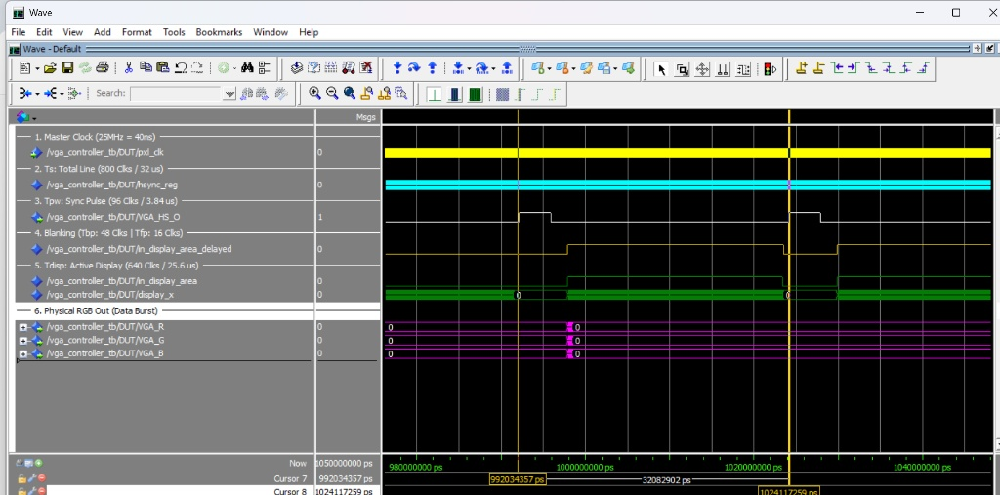

---

<!-- ========================================== -->
<!-- שקף 18: ליבת התצוגה -->
<!-- ========================================== -->

# ליבת התצוגה: אימות האזור הפעיל (Tdisp)

* **תזמון הנתונים:** מתוך כלל מחזור השורה, מוקצים בדיוק 640 מחזורי שעון לציור הפיקסלים.
* **דגל הבקרה:** האות `in_display_area` עולה ל-'1' ומאפשר שליפת נתונים רק בטווח המורשה.
* **מונה הפיקסלים הפעיל:** סופר במדויק מ-0 ועד 639. בחלון זה יציאות ה-RGB פולטות נתונים אקטיביים.

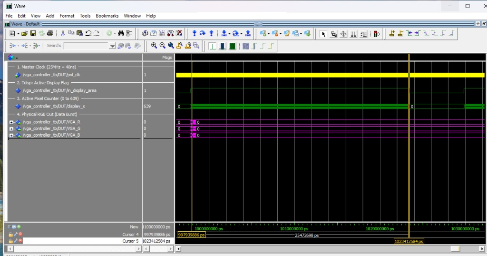

---

<!-- ========================================== -->
<!-- שקף 19: השוליים -->
<!-- ========================================== -->

# אכיפת Blanking: שוליים (Porches)

* **ה'זמנים המתים':** ה-Front Porch וה-Back Porch נועדו לייצוב תנועת הקרן על המסך האנלוגי.
* **אכיפה לוגית:** כשהקרן חורגת מהאזור הפעיל, המערכת מאלצת את כל ערוצי ה-RGB ל-'0000'.
* **התוצאה:** שחור מוחלט באזורי המעבר, מה שמונע 'מריחות' צבע ומאפשר סנכרון חלק.

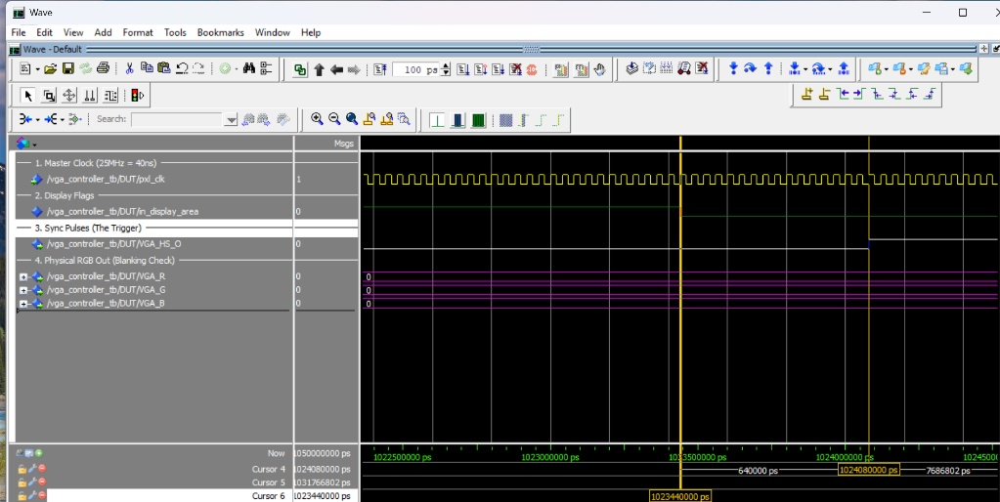

---

<!-- ========================================== -->
<!-- שקף 19.5: המרפסת האחורית -->
<!-- ========================================== -->

# אכיפת Blanking: המרפסת האחורית (Back Porch)

* **זמן המתנה:** לאחר סיום דופק הסנכרון, המערכת ממתינה 48 שעונים לייצוב הקרן.
* **המשך החשכה:** ה-RGB מוחזק במכוון על '0000' כדי למנוע זליגות צבע.
* **חזרת הצבעים:** כשהאות `in_display_area` חוזר ל-'1', רואים בבירור את נתוני ה-RGB האמיתיים פורצים החוצה.

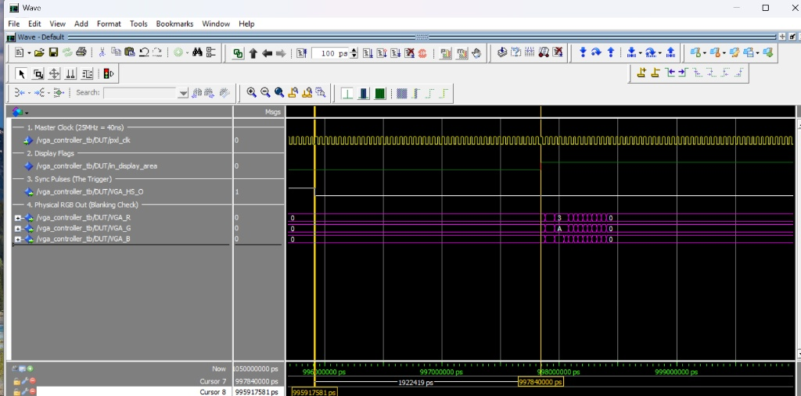

---

<!-- ========================================== -->
<!-- שקף 20: דופק סנכרון -->
<!-- ========================================== -->

# דופק הסנכרון (Tpw) ווריפיקציה אוטומטית

* **אות ה-HSYNC:** הטריגר הפיזי המורה למסך לבצע Retrace לתחילת השורה הבאה.
* **דיוק של מחזור בודד:** מדידת סמנים מוכיחה רוחב דופק מדויק של 3.84us (96 מחזורי שעון).
* **Self-Checking Testbench:** סביבת הבדיקה (TB) כוללת מנגנון `Assert` הבודק את רוחב הדופק אוטומטית.

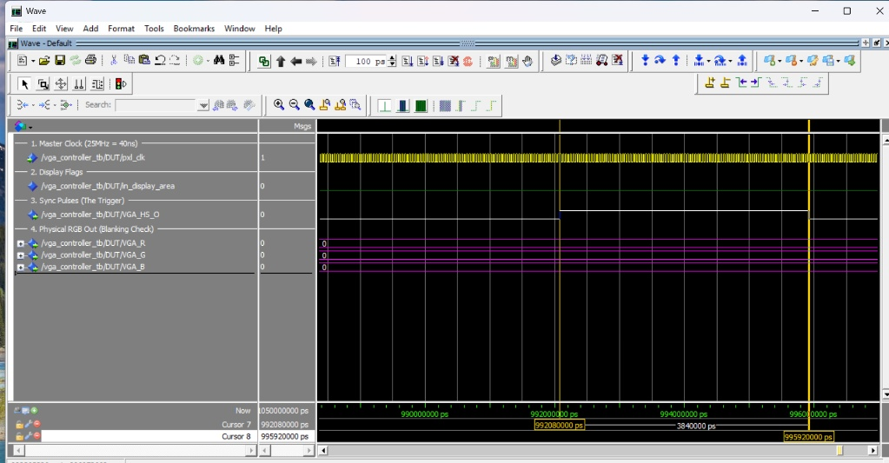

---

<!-- ========================================== -->
<!-- שקף 21: מעבר לחומרה -->
<!-- ========================================== -->

# המעבר לחומרה: מסימולציה ל'קופסה שחורה'

* **העולם האידיאלי (ModelSim):** עד כה בדקנו את הלוגיקה בסביבה וירטואלית ללא עיכובים פיזיים (Zero Latency).
* **המציאות הפיזית (FPGA):** לאחר סינתזה וצריבה, הלוגיקה הופכת ל'קופסה שחורה' עם זמני התפשטות אמיתיים בסיליקון.
* **מגבלת הדיבוג החיצוני:** מבחוץ ניתן למדוד רק את הפינים הפיזיים (RGB, Sync). אין דרך לראות מתי המונה מתאפס.

  

    Artix-7 FPGA (קופסה שחורה) 
    אין גישה לאותות פנימיים
  

  
&#8594;

  

    פינים בלבד (RGB, Sync)
  

---

<!-- ========================================== -->
<!-- שקף 22: פתרון ILA -->
<!-- ========================================== -->

# דיבוג בתוך הסיליקון: Vivado ILA (קופסה לבנה)

* **הפתרון ההנדסי:** הוספת Integrated Logic Analyzer (ILA) – חומרה פנימית שדוגמת אותות ומשדרת למחשב.
* **היתרון:** מאפשר לראות את זמני ההשהיה האמיתיים (Latency) בסיליקון.
* **החיסרון:** "גוזל" משאבי חומרה יקרים מהכרטיס לצורך לוגיקת הדגימה ואגירת הנתונים.

<table style="width: 90%; text-align: center; font-size: 13px; border-collapse: collapse; direction: rtl;">
  <tr style="background-color: #4F81BD; color: white;">
    <th style="padding: 8px; border: 1px solid #ccc;">יעד הבדיקה</th>
    <th style="padding: 8px; border: 1px solid #ccc;">מגבלת ה'קופסה השחורה'</th>
    <th style="padding: 8px; border: 1px solid #ccc;">האות שנדגום ב-ILA</th>
  </tr>
  <tr>
    <td style="padding: 8px; border: 1px solid #ccc; font-weight: bold;">זרימת נתונים ו-Latency</td>
    <td style="padding: 8px; border: 1px solid #ccc; text-align: right;">רואים רק את הפיקסל הסופי מתחלף ביציאה.</td>
    <td style="padding: 8px; border: 1px solid #ccc; text-align: left; direction: ltr;">addrb, doutb, pxl_data_reg</td>
  </tr>
  <tr>
    <td style="padding: 8px; border: 1px solid #ccc; font-weight: bold;">מיקום אופקי</td>
    <td style="padding: 8px; border: 1px solid #ccc; text-align: right;">לא ניתן לדעת איזה פיקסל משורטט כרגע.</td>
    <td style="padding: 8px; border: 1px solid #ccc; text-align: left; direction: ltr;">hsync_debug (hsync_reg)</td>
  </tr>
  <tr>
    <td style="padding: 8px; border: 1px solid #ccc; font-weight: bold;">אכיפת שחור (Blanking)</td>
    <td style="padding: 8px; border: 1px solid #ccc; text-align: right;">רואים מסך חשוך, ללא הקשר תזמוני.</td>
    <td style="padding: 8px; border: 1px solid #ccc; text-align: left; direction: ltr;">in_display_area_delayed</td>
  </tr>
</table>

---

<!-- ========================================== -->
<!-- שקף 23: עלות הדיבוג -->
<!-- ========================================== -->

# עלות הדיבוג: ניתוח משאבי חומרה (Trade-offs)

* **ה-ILA איננו תוכנה:** זוהי חומרה פיזית המסונתזת ונצרבת על הסיליקון לצד לוגיקת התצוגה.
* **פרדוקס הגודל:** בקר ה-VGA שלנו יעיל מאוד, בעוד שמערכת הדיבוג דורשת אלפי רכיבים לוגיים.
* **מסקנה הנדסית:** ה-ILA קריטי לשלבי הפיתוח, אך יוסר בגרסת הייצור (Release) כדי לחסוך בשטח.

  
  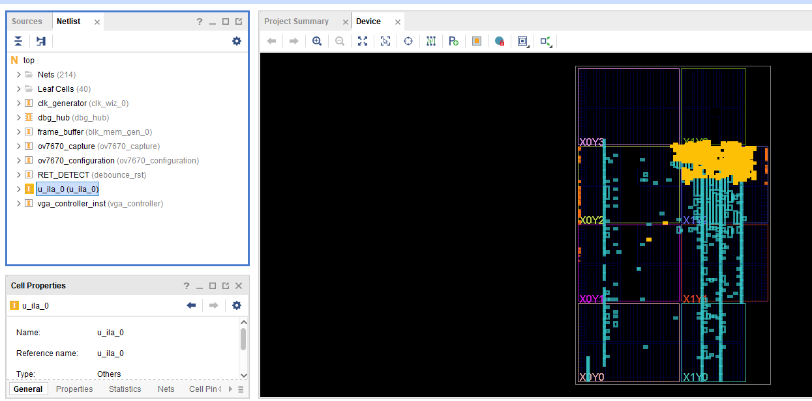

  <table style="width: 45%; text-align: center; font-size: 12px; border-collapse: collapse; direction: rtl;">
    <tr style="background-color: #4F81BD; color: white;">
      <th style="padding: 6px; border: 1px solid #ccc;">מודול (Module)</th>
      <th style="padding: 6px; border: 1px solid #ccc;">LUTs</th>
      <th style="padding: 6px; border: 1px solid #ccc;">Registers</th>
      <th style="padding: 6px; border: 1px solid #ccc;">BRAM</th>
    </tr>
    <tr>
      <td style="padding: 6px; border: 1px solid #ccc; font-weight: bold; text-align: left; direction: ltr;">VGA Controller</td>
      <td style="padding: 6px; border: 1px solid #ccc;">47</td>
      <td style="padding: 6px; border: 1px solid #ccc;">52</td>
      <td style="padding: 6px; border: 1px solid #ccc;">0</td>
    </tr>
    <tr>
      <td style="padding: 6px; border: 1px solid #ccc; font-weight: bold; text-align: left; direction: ltr;">ILA + Debug Hub</td>
      <td style="padding: 6px; border: 1px solid #ccc;">1,732</td>
      <td style="padding: 6px; border: 1px solid #ccc;">2,642</td>
      <td style="padding: 6px; border: 1px solid #ccc;">1.5</td>
    </tr>
    <tr style="background-color: #f2f2f2; font-weight: bold;">
      <td style="padding: 6px; border: 1px solid #ccc; text-align: left; direction: ltr;">Total Design</td>
      <td style="padding: 6px; border: 1px solid #ccc;">2,756</td>
      <td style="padding: 6px; border: 1px solid #ccc;">2,890</td>
      <td style="padding: 6px; border: 1px solid #ccc;">105</td>
    </tr>
  </table>

---

<!-- ========================================== -->
<!-- שקף 24: תמונת ILA מלאה -->
<!-- ========================================== -->

# Post-Silicon Validation: מסלול הנתונים בסיליקון

* כאן אנו דוגמים את החומרה הפיזית פועלת בזמן אמת באמצעות ה-ILA.
* **השהיית זיכרון (Latency):** שימו לב לפער הפיזי - הכתובת נשלחת, אך הנתון מופיע רק לאחר מכן.
* **אכיפת שומר הסף:** למרות שהאוגר התמלא, רק בקו הצהוב, כשהדגל עולה ל-'1', נתוני ה-RGB נפרצים החוצה.

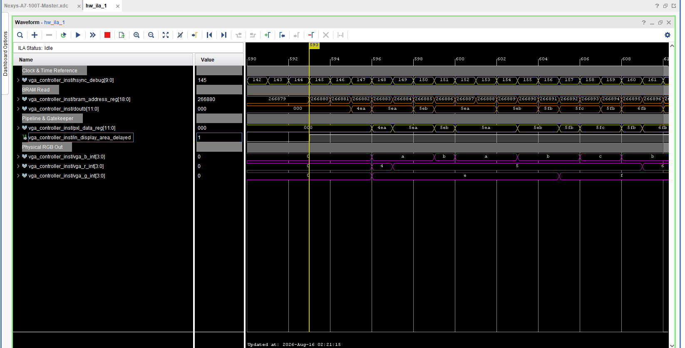

---

<!-- ========================================== -->
<!-- שקף 25: סיכום סימולציה מול סיליקון -->
<!-- ========================================== -->

# סיכום וריפיקציה: סימולציה (ModelSim) מול סיליקון (ILA)

* **המעבר מקופסה שחורה ללבנה:** נאלצנו להוסיף אטריביוט ל-VHDL כדי להורות לסינתזה לשמר חוטים למדידה (White-Box).
* **הוכחת הפיזיקה:** הטבלה מתארת כיצד התיאוריה מהסימולציה תורגמה לתופעות חשמליות/פיזיות בתוך ה-FPGA.

<table style="width: 95%; text-align: center; font-size: 12px; border-collapse: collapse; direction: rtl;">
  <tr style="color: white;">
    <th style="padding: 8px; border: 1px solid #ccc; background-color: #282828;">האות ב-Data Path</th>
    <th style="padding: 8px; border: 1px solid #ccc; background-color: #4F81BD;">ModelSim (סביבה וירטואלית)</th>
    <th style="padding: 8px; border: 1px solid #ccc; background-color: #4F81BD;">Vivado ILA (הסיליקון הפיזי)</th>
  </tr>
  <tr>
    <td style="padding: 8px; border: 1px solid #ccc; font-weight: bold; text-align: left; direction: ltr;">bram_address_reg</td>
    <td style="padding: 8px; border: 1px solid #ccc; text-align: right;">עדכון מתמטי באפס זמן (0ns).</td>
    <td style="padding: 8px; border: 1px solid #ccc; text-align: right;">ניתוב פיזי: 19 חוטים שמפעילים את פורט הקריאה בזיכרון.</td>
  </tr>
  <tr>
    <td style="padding: 8px; border: 1px solid #ccc; font-weight: bold; text-align: left; direction: ltr;">doutb (תגובת BRAM)</td>
    <td style="padding: 8px; border: 1px solid #ccc; text-align: right;">המידע מופיע מיידית ובקסם.</td>
    <td style="padding: 8px; border: 1px solid #ccc; text-align: right;">הוכחת Latency: חשיפת זמן התגובה האמיתי של החומרה.</td>
  </tr>
  <tr>
    <td style="padding: 8px; border: 1px solid #ccc; font-weight: bold; text-align: left; direction: ltr;">pxl_data_reg</td>
    <td style="padding: 8px; border: 1px solid #ccc; text-align: right;">השמת משתנה תוכנתית פשוטה.</td>
    <td style="padding: 8px; border: 1px solid #ccc; text-align: right;">יציבות חומרה: הפליפ-פלופים דוגמים כראוי למרות ההשהיה.</td>
  </tr>
  <tr>
    <td style="padding: 8px; border: 1px solid #ccc; font-weight: bold; text-align: left; direction: ltr;">in_display_area_dly</td>
    <td style="padding: 8px; border: 1px solid #ccc; text-align: right;">דגל בוליאני (True/False).</td>
    <td style="padding: 8px; border: 1px solid #ccc; text-align: right;">פיקוד פיזי (Select Line) שכופה ניתוב על המרבבים.</td>
  </tr>
  <tr>
    <td style="padding: 8px; border: 1px solid #ccc; font-weight: bold; text-align: left; direction: ltr;">vga_r/g/b_int</td>
    <td style="padding: 8px; border: 1px solid #ccc; text-align: right;">מחרוזות תווים וירטואליות.</td>
    <td style="padding: 8px; border: 1px solid #ccc; text-align: right;">אכיפה חשמלית: חיווט הפינים לאדמה למניעת זליגות.</td>
  </tr>
</table>

